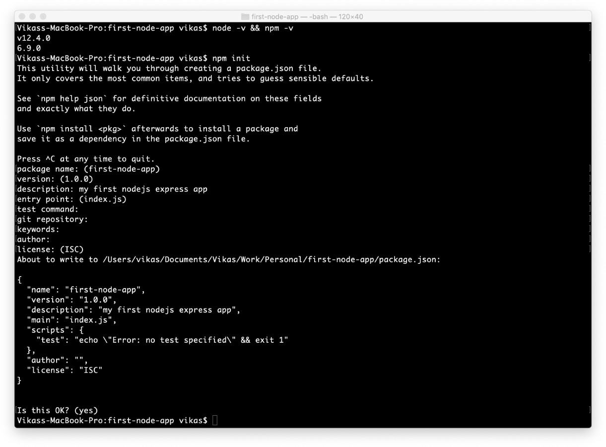
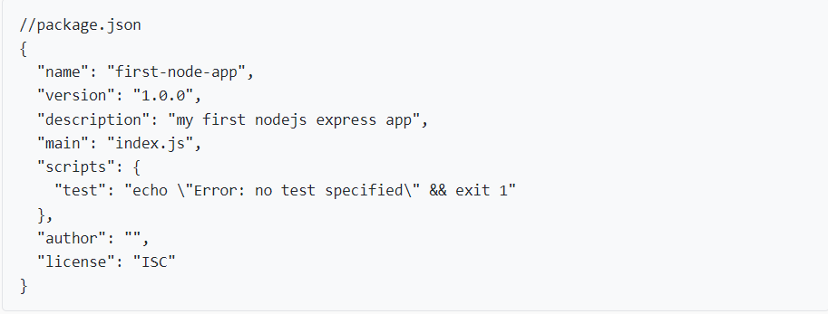

# ExpressJs

## Tools required

<a></a>
<a></a>

# Table of contents

1. [What is an ExpressJs?](#introduction)
2. [Features of Express JS](#features)

   - [Server-Side Development](#server-side)
   - [Middleware](#middleware)
   - [Routing](#routing)
   - [Templating / Static Server](#templating)
   - [Debugging](#debugging)

3. [Installation Guide](#guide)
4. [Coding with ExpressJs](#code)

<hr>
<hr>

<p name="introduction">

## What is ExpressJs

> Express JS is a Node.js framework designed to build API's web applications cross-platform mobile apps quickly and make node js easy.

## Why ExpressJS?

> - Express was created to make APIs and web applications with ease,
> - t saves a lot of coding time almost by half and still makes web and mobile applications are efficient.
> - Another reason for using express is that it is written in javascript as javascript is an easy language even if you don't have a previous
> - knowledge of any language. Express lets so many new developers enter the field of web development.

### <b>The reason behind creating an express framework for node js is</b>:

- Time-efficient
- Fast
- Economical
- Easy to learn
- Asynchronous
</p>

<p name="features">

# Features of Express JS

> <p name="server-side">

### Fast Server-Side Development

> - The features of node js help express saving a lot of time.

</p>

<p name="middleware">

### Middleware

> Middleware is a request handler that has access to the application's request-response cycle.

</p>
<p name="routing">

### Routing

> It refers to how an application's endpoint's URLs respond to client requests.

</p>
<p name="templating">

### Templating / Static Server

> It provides templating engines to build dynamic content on the web pages by creating <b>HTML templates</b> on the server.

</p>
<p name="debugging">

### Debugging

> Express makes it easier as it identifies the exact part where bugs are.

</p>
</p>

<p name="guide">

## Installation Guide

### Step by step guide to start an express app

- ## Step1: Install Node.js

  > To install Node.js and NPM, use any of the official <a href="https://nodejs.dev/" target="_blank">Node.js</a> installers provided for your operating system.

- ## Step 2: Initialize Node app – Role of Package.json
  > - Assuming you’ve installed Node.js on your machine, Now create a working directory to hold your application and init the nodejs app. <br>
  > - Run command npm init, It will create a package.json file for your application in your working directory.

```Javascript
npm init / npm init -y
```

|                 CMD                  |                Package.json                |
| :----------------------------------: | :----------------------------------------: |
|  |  |

- ## Step 3 – Install Express.js
  > Install Express using command: <br> > `npm install express / npm i express`

</p>
<br>

<p name="code">

## Coding With ExpressJs

> <b>Lets initialize our express app</b>

```ruby
const express = require('express'); # importing express package


const app = express(); # Declearing our app

app.use(express.json()) # replacement of body-parser


const port = process.env.PORT || 3000
app.set("port", process.env.PORT); # Setting the port

# Routes Are Placed Here
app.get('/', (req, res) => {
  res.send('Hello World!')
})

app.listen(app.get("port"), () => {
  console.log(`http://localhost:${app.get("port")}`);
  console.log("Press Ctrl+C to exit server");
});
// Starts our express app / api
```

</p>
